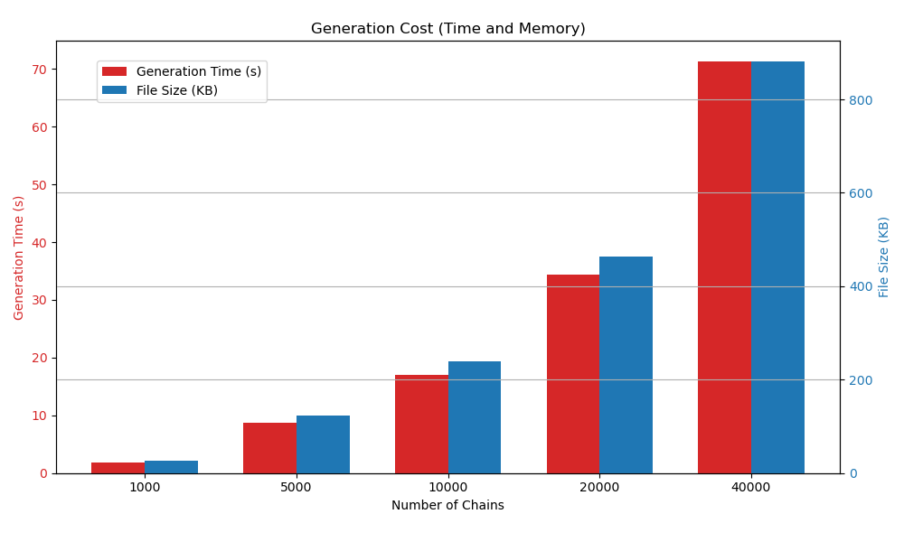
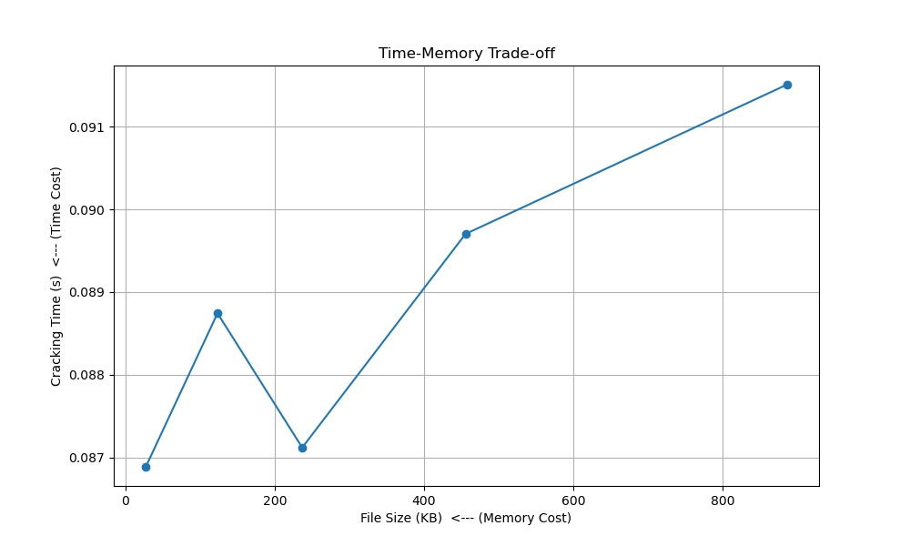

# Rainbow Table Hash Cracker

A Python implementation of a classic **Rainbow Table** — a pre-computed data structure used to speed up cracking of password hashes by trading memory for time. This repository provides tools to **generate** rainbow tables, **crack** hashes using those tables, and **analyze** the time–memory trade-off.

🔗 https://github.com/abhi5hek001/rainbow-table-TMTO/blob/main/presentation.pdf

---

## Features

* Generate rainbow tables for **SHA1** and **MD5**.
* Support for configurable character sets and password length ranges.
* Crack target hashes using pre-computed rainbow tables.
* Experimental analysis script to measure the time–memory trade-off and visualize results.
* Simple, easy-to-follow CLI interface.

---

## Requirements

The project was developed and tested on Python 3.8+. The analysis visualization requires the following Python packages:

* `pandas`
* `numpy`
* `matplotlib`

Install them using conda or pip. Example with conda (recommended if you have an environment named `crypto`):

```bash
# from your (crypto) conda environment
conda install pandas matplotlib numpy
```

Or with pip:

```bash
pip install pandas numpy matplotlib
```

---

## Files & Scripts

* `rainbowgen.py` — Create a rainbow table file (.rt). CLI: `python3 rainbowgen.py algorithm charset min_length max_length chain_length n_chains output_file`
* `rainbowcrack.py` — Try to recover a plaintext password for a target hash using a `.rt` table. CLI: `python3 rainbowcrack.py hash_string table_file`
* `analyze_tradeoff.py` — Run an experiment that generates multiple tables of different sizes and plots generation time, table size, and cracking success rate.
* `utils.py` *(or similar helper modules)* — (If present) helper functions for hashing, reduction functions, charset definitions, and table serialization.

---

## Usage

### 1. Generate a Rainbow Table

```bash
python3 rainbowgen.py sha1 alphanumeric 1 6 200 10000 my_table.rt
```

This example generates a SHA1 rainbow table for alphanumeric passwords of length 1–6, with 10,000 chains each of length 200, and saves it to `my_table.rt`.

**CLI arguments**

* `algorithm` — `sha1` or `md5`.
* `charset` — a predefined charset name (e.g. `alphanumeric`, `lowercase`, `digits`, etc.). Charset definitions are in the project config.
* `min_length` / `max_length` — minimum and maximum password length (integers).
* `chain_length` — number of reduction/hash steps per chain (integer).
* `n_chains` — number of chains to generate (integer).
* `output_file` — path to save the generated `.rt` file.

### 2. Crack a Hash

```bash
python3 rainbowcrack.py e175ea4ce0a553260a14bc5e922a935b40425c1e my_table.rt
```

If the hash maps to a chain endpoint in `my_table.rt`, the script will attempt to reconstruct the original plaintext by walking the chain backwards and testing candidate plaintexts.

**Note:** Rainbow tables do not guarantee recovery for every hash — they provide a probability of success that increases with table coverage.

### 3. Run the Analysis Experiment

```bash
python3 analyze_tradeoff.py
```

This script (as included in the repo) generates several tables with increasing numbers of chains, times the generation step, measures file sizes, and attempts to crack a test set of random hashes to measure success rates. It outputs a summary table and two plots:

* Generation cost: File size (KB) vs Generation time (s)
* Time–Memory Trade-off: Success rate (%) vs Table file size (KB)

An example experiment summary included with the project shows results for 1k, 5k, 10k, 20k, and 40k chains.

---

## Example Experiment Summary (from included run)

```
--- Experiment Summary ---
|     Chains |   File Size (KB) |   Generation Time (s) |   Success Rate (%) |
|-----------:|-----------------:|----------------------:|-------------------:|
|  1000.0000 |          27.5186 |                1.7888 |              16.00 |
|  5000.0000 |         122.6064 |                8.8787 |              18.00 |
| 10000.0000 |         236.7842 |               16.3868 |              24.00 |
| 20000.0000 |         459.3545 |               35.7878 |              25.00 |
| 40000.0000 |         883.4658 |               71.2410 |              30.00 |
```

<div style="display:flex; gap:20px; align-items:center; justify-content:center;">
  
  
</div>

These results highlight the trade-off: larger tables (more file size) take longer to create but tend to increase cracking success rates.

---

## Implementation Notes

* **Hash & Reduction Functions:** The generator alternates between hashing a candidate plaintext (MD5 or SHA1) and applying a deterministic reduction function to produce the next plaintext in the chain. The reduction should depend on the step index so the same hash reduces differently at different positions in a chain.

* **Table Format:** The `.rt` file stores (start_plaintext, end_hash) tuples for each chain. For quick lookup, the cracker searches for a matching end_hash and then walks the chain forward from the corresponding start plaintext.

* **Collisions & Coverage:** Real rainbow tables use advanced techniques to reduce chain collisions (e.g., multiple reduction functions, distinguished points). This project implements a simplified single-reduction scheme sufficient for demonstration and experimentation.

---

## Limitations & Ethical Notice

* This implementation is intended for **educational and research** purposes only.
* Hash cracking can be used maliciously. Do **not** use these tools on systems, hashes, or data for which you do not have explicit permission.
* Rainbow tables have limited applicability against salted hashes (unique salts per password), which is why modern systems use salt + slow hashing (e.g., bcrypt, scrypt, Argon2).

---

## Performance Tips

* Increase `n_chains` and `chain_length` for higher coverage — at the cost of more memory and generation time.
* Use multiple reduction functions or distinguished point optimization to reduce collisions and improve coverage.
* Use a faster language or parallelize chain generation if you intend to scale massively (Python is convenient for learning but not the fastest for very large tables).

---

## Team 
Abhishek Sahay \
Neeraj Kumar \
Nokesh Lavudi